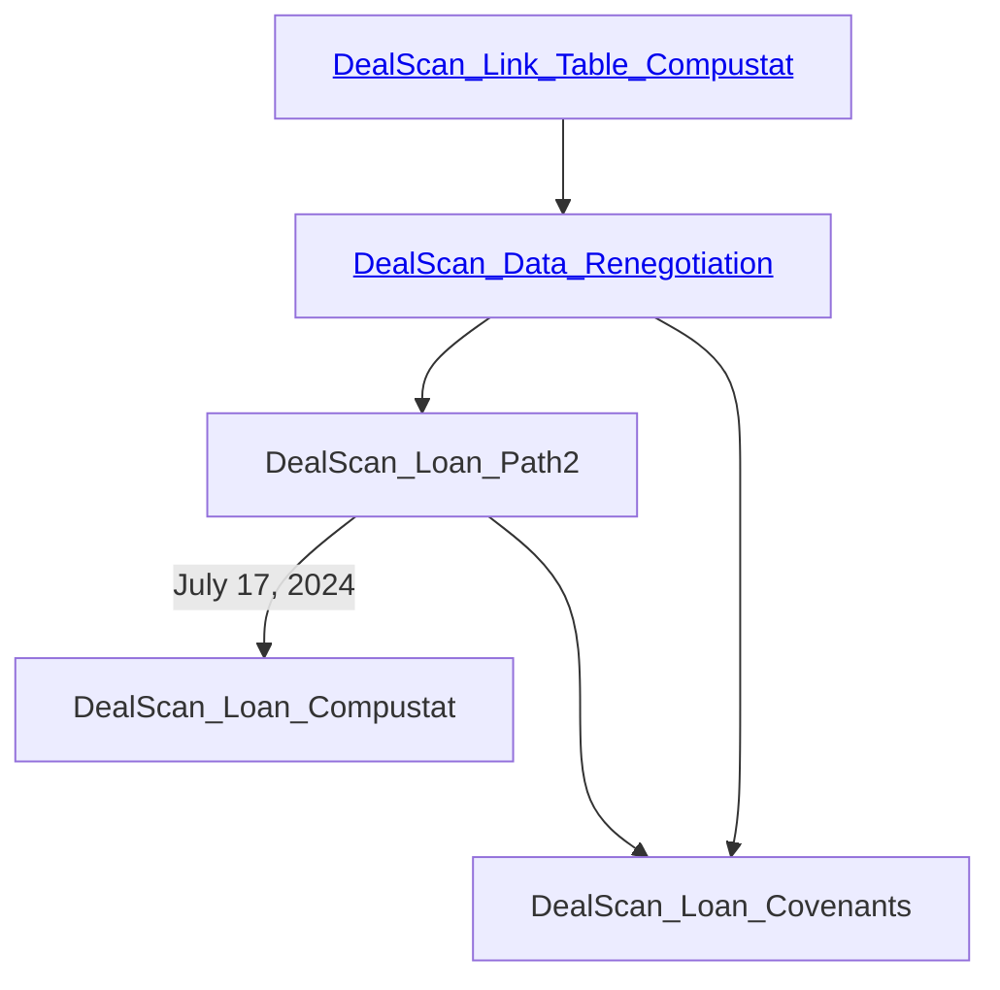

## Working Papers: 

-  Renegotiations with News: information economics [>roadmap](https://github.com/hongyileoxu/hongyileoxu.github.io/blob/31feac4143586de784a5b2032bfdac3b511666df/research/project-2024/DealScan2024/readme.md)

    -  [Step 1: Link Table](https://hongyileoxu.github.io/research/project-2024/DealScan2024/DealScan_Link_Table_Compustat.html)
    -  [Step 2: DealScan Data](https://hongyileoxu.github.io/research/project-2024/DealScan2024/DealScan_Data_Renegotiation.html)
    -  [Step 3: Loan Path](https://hongyileoxu.github.io/research/project-2024/DealScan2024/DealScan_Loan_Path2.html) 
Clean the WRDS LPC DealScan Data and convert to a firm-deal-time level panel data, with links to be connected to Compustat.
 
    -  [Step 4: Compustat Data](https://hongyileoxu.github.io/research/project-2024/DealScan2024/DealScan_Loan_Compustat.html)
    
<!--- 

Click here for explanation
Some text 
 --->

<pre class="mermaid">
  graph LR;
    A[<a href='https://hongyileoxu.github.io/research/project-2024/DealScan2024/DealScan_Link_Table_Compustat.html'>DealScan_Link_Table_Compustat</a>] --> B[<a href='https://hongyileoxu.github.io/research/project-2024/DealScan2024/DealScan_Data_Renegotiation.html'>DealScan_Data_Renegotiation</a>] --> C[<a href='https://hongyileoxu.github.io/research/project-2024/DealScan2024/DealScan_Loan_Path2.html'>DealScan_Loan_Path2</a>];
    C[DealScan_Loan_Path2] --July 17, 2024--> D[DealScan_Loan_Compustat];
    C[DealScan_Loan_Path2] ---> D2[DealScan_Loan_Covenants];
    B --> D2;
    click C "https://hongyileoxu.github.io/research/project-2024/DealScan2024/DealScan_Loan_Path2.html"; 
    </pre>
    

