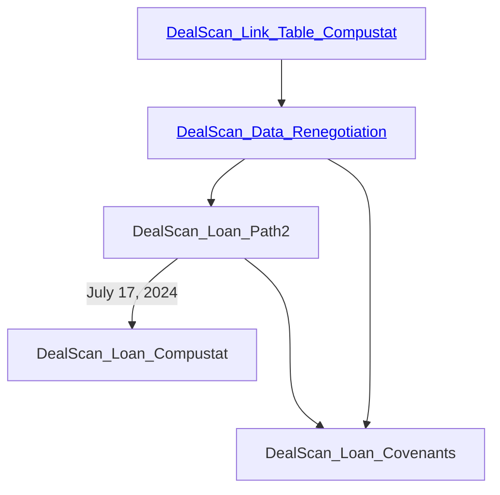

This is a document to record the roadmap: 

1.    DealScan_Link_Table_Compustat.html > DealScan_Link_Table_Compustat_Jun2024: for the link table between WRDS DealScan and WRDS Compustat.
2.    DealScan_Data_Renegotiation > DealScan_Data_Renegotiations_Jun2024: a preview on the DealScan data and delineate loan path identification and creation process.
3.    DealScan_Loan_Path2.html > DealScan_Loan_Path_Jun2024: generate the panel dataset for firm-loan-time observations and it can be linked to the Compustat dataset. 
4.    

----- 

| DealScan Fields for FTP                | Definition                                                                                                                                                                                                                                                                                                                                                                                                                                       | Field Type | Schema Field Name            | Schema Table Name               | Additional Information      |
| -------------------------------------- | ------------------------------------------------------------------------------------------------------------------------------------------------------------------------------------------------------------------------------------------------------------------------------------------------------------------------------------------------------------------------------------------------------------------------------------------------ | ---------- | ---------------------------- | ------------------------------- | --------------------------- |
|                                        |                                                                                                                                                                                                                                                                                                                                                                                                                                                  |            |                              |                                 |                             |
| Borrower                               |                                                                                                                                                                                                                                                                                                                                                                                                                                                  |            |                              |                                 |                             |
| Borrower ID                            | The unique ID assigned to the borrower name.                                                                                                                                                                                                                                                                                                                                                                                                     | N          | BORR_ID                      | LC_BORROWER                     |                             |
| Borrower Name                          | The native language name of the company.                                                                                                                                                                                                                                                                                                                                                                                                         | T/N        | BORR_NM                      | LC_BORROWER                     |                             |
| Additional Borrowers                   | Names of additonal borrowers associated with the loan.                                                                                                                                                                                                                                                                                                                                                                                           | T/N        | BORR_ID                      | LC_DEAL_ADDITIONAL_BORR         |                             |
| Ticker                                 | The public ticker of the company.                                                                                                                                                                                                                                                                                                                                                                                                                | T          | TICKER                       | LC_BORROWER                     |                             |
| Perm ID                                | PermIDs are open, permanent and universal identifiers where underlying attributes capture the context of the identity they each represent.                                                                                                                                                                                                                                                                                                       | N          | ENTITY_PERMID                | LC_BORROWER                     |                             |
| City                                   | The city where the company operates from, most likely its headquarters.                                                                                                                                                                                                                                                                                                                                                                          | T          | CITY                         | LC_BORROWER                     |                             |
| State/Province                         | The State or Province where the company primarily operates in.                                                                                                                                                                                                                                                                                                                                                                                   | T          | STATE_CD                     | LC_BORROWER                     |                             |
| ZIP                                    | The postal zip code of the borrower.                                                                                                                                                                                                                                                                                                                                                                                                             | N          | ZIP                          | LC_BORROWER                     |                             |
| Country                                | The recognized operating country of the company.                                                                                                                                                                                                                                                                                                                                                                                                 | T          | COUNTRY_CD                   | LC_BORROWER                     |                             |
| Region                                 | The recognized operating region of the company.                                                                                                                                                                                                                                                                                                                                                                                                  | T          | REGION_CD                    | LC_DEAL_TERMS                   |                             |
| Sales Size                             | The latest FYE revenue figures for the company.                                                                                                                                                                                                                                                                                                                                                                                                  | N          | SALES_AMT                    | LC_BORROWER                     |                             |
| Broad Industry Group                   | The company's major industry classification.                                                                                                                                                                                                                                                                                                                                                                                                     | T          | BROAD_INDU_CD                | LC_BORROWER                     |                             |
| Major Industry Group                   | The company's broad industry classification.                                                                                                                                                                                                                                                                                                                                                                                                     | T          | INDUSTRY_CD                  | LC_BORROWER                     |                             |
| SIC Code                               | The company's primary Standard Industry Classification number                                                                                                                                                                                                                                                                                                                                                                                    | T/N        | SIC_CD                       | LC_BORROWER                     |                             |
| NAIC                                   | The company's North American Industry Classification number.                                                                                                                                                                                                                                                                                                                                                                                     | T/N        | NAIC_CD                      | LC_BORROWER                     |                             |
| Borrower Type                          | A description of the company's business practice.                                                                                                                                                                                                                                                                                                                                                                                                | T          | INSTITUTION_TY_CD            | LC_BORROWER                     |                             |
| Parent                                 | The parent company of the borrower.                                                                                                                                                                                                                                                                                                                                                                                                              | T          | PARENT_COMPANY_ID            | LC_FAC_LENDER_ROLE              |                             |
| Parent Ticker                          | The public ticker of the parent company.                                                                                                                                                                                                                                                                                                                                                                                                         | T          | TICKER                       | LC_BORROWER                     |                             |
| Sponsor                                | The company who is the sponsor of the loan.                                                                                                                                                                                                                                                                                                                                                                                                      | T          | SPONSORED_FL                 | LC_FAC_TERMS                    |                             |
| Guarantor                              | The company who is the guarantor of the loan.                                                                                                                                                                                                                                                                                                                                                                                                    | T          | BORR_ID                      | LC_FAC_GUARANTOR                |                             |
| Target                                 | The company who is the target acquisition through the use of the loan.                                                                                                                                                                                                                                                                                                                                                                           | T          | BORR_ID                      | LC_FAC_TARGET_CO                |                             |
| Organisation Type                      | The type of organization the company is.                                                                                                                                                                                                                                                                                                                                                                                                         | T          | ORG_TYPE_CD                  | LC_BORR_ORGANIZATION            |                             |
| Senior Debt to EBITDA                  | Most recent Senior Debt to EBITDA level.                                                                                                                                                                                                                                                                                                                                                                                                         | N          | LC_DEAL_FINANCIALS           | PRO_FORMA_RATIO                 |                             |
| Total Debt to EBITDA                   | Most recent Total Debt to EBITDA level.                                                                                                                                                                                                                                                                                                                                                                                                          | N          | LC_DEAL_FINANCIALS           | PRO_FORMA_RATIO                 |                             |
| Company Url                            | The website address of the borrower.                                                                                                                                                                                                                                                                                                                                                                                                             | T/N        | COMPANY_URL                  | LC_BORROWER                     |                             |
|                                        |                                                                                                                                                                                                                                                                                                                                                                                                                                                  |            |                              |                                 |                             |
| Lender                                 |                                                                                                                                                                                                                                                                                                                                                                                                                                                  |            |                              |                                 |                             |
| Lender Name                            | The name of the lender on the loan.                                                                                                                                                                                                                                                                                                                                                                                                              | T/N        | BORR_NM                      | LC_BORROWER                     |                             |
| Lender Parent Name                     | The parent name of the lender on the loan.                                                                                                                                                                                                                                                                                                                                                                                                       | T/N        | PARENT_BORR_ID               | LC_FAC_LENDER_ROLE              |                             |
| Lead Arranger                          | The lender(s) who acted as Lead Arranger on the loan.                                                                                                                                                                                                                                                                                                                                                                                            | T/N        | LEAD_ARRANGE_FL              | LC_FAC_LENDER_SHARES            |                             |
| Number of Lead Arrangers               | The number of banks who are recognized as Lead Arranger.                                                                                                                                                                                                                                                                                                                                                                                         | N          |                              |                                 | COUNT OF APPLICABLE LENDERS |
| Bookrunner                             | The lender(s) who acted as Bookrunner on the loan.                                                                                                                                                                                                                                                                                                                                                                                               | T/N        | LENDER_ROLE_CD               | LC_FAC_LENDER_ROLE              |                             |
| Number of Bookrunners                  | The number of banks who are recognized as Bookrunner.                                                                                                                                                                                                                                                                                                                                                                                            | N          |                              |                                 | COUNT OF APPLICABLE LENDERS |
| Top Tier Arranger                      | The lender(s) who acted as Top Tier Arranger on the loan.                                                                                                                                                                                                                                                                                                                                                                                        | T/N        | TOP_TIER_ARRANGERS_FL        | LC_FAC_LENDER_ROLE              |                             |
| Number of Top Tier Arrangers           | The number of banks who are recognized as Top Tier Arrangers.                                                                                                                                                                                                                                                                                                                                                                                    | N          |                              |                                 | COUNT OF APPLICABLE LENDERS |
| Lead Left                              | The lender(s) who acted as Lead Left on the loan.                                                                                                                                                                                                                                                                                                                                                                                                | T/N        | LENDER_ROLE_CD               | LC_FAC_LENDER_ROLE              |                             |
| Number of Lead Left                    | The number of banks who are recognized as Lead Left.                                                                                                                                                                                                                                                                                                                                                                                             | N          |                              |                                 | COUNT OF APPLICABLE LENDERS |
| Arranger                               | The lender(s) who acted as Arranger on the loan.                                                                                                                                                                                                                                                                                                                                                                                                 | T/N        | LENDER_ROLE_CD               | LC_FAC_LENDER_ROLE              |                             |
| Number of Arrangers                    | The number of banks who are recognized as Arranger.                                                                                                                                                                                                                                                                                                                                                                                              | N          |                              |                                 | COUNT OF APPLICABLE LENDERS |
| Co-Arranger                            | The lender(s) who acted as Co-Arranger on the loan.                                                                                                                                                                                                                                                                                                                                                                                              | T/N        | LENDER_ROLE_CD               | LC_FAC_LENDER_ROLE              |                             |
| Number of Co-Arrangers                 | The number of banks who are recognized as Co-Arranger.                                                                                                                                                                                                                                                                                                                                                                                           | N          |                              |                                 | COUNT OF APPLICABLE LENDERS |
| Agent                                  | The lender(s) who acted as Agent on the loan and their role.                                                                                                                                                                                                                                                                                                                                                                                     | T/N        | AGENT_CREDIT_FL              | LC_FAC_LENDER_SHARES            |                             |
| Number of Agents                       | The number of banks who are recognized as Agent.                                                                                                                                                                                                                                                                                                                                                                                                 | N          |                              |                                 | COUNT OF APPLICABLE LENDERS |
| Lead Manager                           | The lender(s) who acted as Lead Manager on the loan.                                                                                                                                                                                                                                                                                                                                                                                             | T/N        | LENDER_ROLE_CD               | LC_FAC_LENDER_ROLE              |                             |
| Number of Lead Managers                | The number of banks who are recognized as Lead Manager.                                                                                                                                                                                                                                                                                                                                                                                          | N          |                              |                                 | COUNT OF APPLICABLE LENDERS |
| All Lenders                            | The lender(s) who participated in some capacity on the loan.                                                                                                                                                                                                                                                                                                                                                                                     | T/N        | LENDER_ROLE_CD               | LC_FAC_LENDER_ROLE              |                             |
| Number of Lenders                      | The number of banks who particpated in some capacity on the loan.                                                                                                                                                                                                                                                                                                                                                                                | N          |                              |                                 | COUNT OF APPLICABLE LENDERS |
| Role/Title                             | The Role or Title of the lender(s) involved in the loan.                                                                                                                                                                                                                                                                                                                                                                                         | T          | LENDER_ROLE_CD               | LC_FAC_LENDER_ROLE              |                             |
| Lender Region                          | The region where the Lender(s) on the loan operate.                                                                                                                                                                                                                                                                                                                                                                                              | T          | SUB_REGION_CD                | LC_BORROWER                     |                             |
| Lender Operating Country               | The country where the Lender(s) on the loan operate.                                                                                                                                                                                                                                                                                                                                                                                             | T          | COUNTRY_CD                   | LC_BORROWER                     |                             |
| Lender Parent Region                   | The region where the Parent Lender(s) on the loan operate.                                                                                                                                                                                                                                                                                                                                                                                       | T          | SUB_REGION_CD                | LC_BORROWER                     |                             |
| Lender Parent Operating Country        | The country where the Parent Lender(s) on the loan operate.                                                                                                                                                                                                                                                                                                                                                                                      | T          | COUNTRY_CD                   | LC_BORROWER                     |                             |
| Lender Institution Type                | The type of Institution the lender is.                                                                                                                                                                                                                                                                                                                                                                                                           | T          | INSTITUTION_TY_CD            | LC_BORROWER                     |                             |
|                                        |                                                                                                                                                                                                                                                                                                                                                                                                                                                  |            |                              |                                 |                             |
|                                        |                                                                                                                                                                                                                                                                                                                                                                                                                                                  |            |                              |                                 |                             |
| Deal                                   |                                                                                                                                                                                                                                                                                                                                                                                                                                                  |            |                              |                                 |                             |
| Deal ID                                | The unique ID assigned to a Deal                                                                                                                                                                                                                                                                                                                                                                                                                 | N          | DEAL_ID                      | LC_DEAL_TERMS                   |                             |
| Deal Amount                            | The total amount of the loan package.                                                                                                                                                                                                                                                                                                                                                                                                            | N          | COMMITMENT                   | LC_DEAL_TERMS                   |                             |
| Deal Amount Converted (m)(USD)         | The converted amount of the loan package based on Currency selection.  Defaults to $USD.                                                                                                                                                                                                                                                                                                                                                         | N          | COMMITMENT_IN_USD            | LC_DEAL_TERMS                   |                             |
| Deal Input Date                        | The date the latest addition or changes were input.                                                                                                                                                                                                                                                                                                                                                                                              | D          | ACTIVE_DT                    | LC_DEAL_MASTER                  |                             |
| Deal Active Date                       | The active or closing date of the loan package.                                                                                                                                                                                                                                                                                                                                                                                                  | D          | CURRENCY_CD                  | LC_DEAL_TERMS                   |                             |
| Deal Currency                          | The Primary Currency that the loan package was issued in.                                                                                                                                                                                                                                                                                                                                                                                        | T          | INPUT_DT                     | LC_DEAL_AMENDMENT               |                             |
| Deal Purpose                           | The Primary Purpose of the loan package.                                                                                                                                                                                                                                                                                                                                                                                                         | T          | PURP_CD                      | LC_DEAL_TERMS                   |                             |
| Project Finance                        | Indication that the loan package is a Project Finance transaction and what specific project it backs.                                                                                                                                                                                                                                                                                                                                            | T          | PROJ_FIN_TY_CD               | LC_DEAL_TERMS                   |                             |
| Phase                                  | The current phase of the loan package.                                                                                                                                                                                                                                                                                                                                                                                                           | T          | STATUS_CD                    | LC_DEAL_MASTER                  |                             |
| Deal Active Flag                       | Indication of whether or not the loan package is active or not (Yes/No).                                                                                                                                                                                                                                                                                                                                                                         | T          | ACTIVE_FL                    | LC_DEAL_MASTER                  |                             |
| Deal Refinancing                       | Indication of whether or not the loan package refinanced a prior loan.                                                                                                                                                                                                                                                                                                                                                                           | T          | REFINANCING_FL               | LC_DEAL_MASTER                  |                             |
| Purpose Remark                         | Further information on the Deal's purpose.                                                                                                                                                                                                                                                                                                                                                                                                       | T          | COMMENT_TY_CD                | LC_DEAL_COMMENT                 |                             |
| Deal Remark                            | Further information on the Deal in general.                                                                                                                                                                                                                                                                                                                                                                                                      | T          | COMMENT_TY_CD                | LC_DEAL_COMMENT                 |                             |
| Deal Amended Flag                      | Indication if the Deal has been amended (Yes/No).                                                                                                                                                                                                                                                                                                                                                                                                | T          | IS_AMENDED                   | LC_DEAL_MASTER                  |                             |
| Sales Size at Close (m)                | Borrower revenue at the time of the Deal's closing.                                                                                                                                                                                                                                                                                                                                                                                              | N          | SALES_AT_CLOSE               | LC_DEAL_TERMS                   |                             |
|                                        |                                                                                                                                                                                                                                                                                                                                                                                                                                                  |            |                              |                                 |                             |
|                                        |                                                                                                                                                                                                                                                                                                                                                                                                                                                  |            |                              |                                 |                             |
| Tranche                                |                                                                                                                                                                                                                                                                                                                                                                                                                                                  |            |                              |                                 |                             |
| Tranche ID                             | The unique ID assigned to a tranche.                                                                                                                                                                                                                                                                                                                                                                                                             | N          | FAC_TERMS_ID                 | LC_FAC_TERMS                    |                             |
| Tranche Type                           | The specific tranche type.                                                                                                                                                                                                                                                                                                                                                                                                                       | T          | LOAN_TY_CD                   | LC_FAC_TERMS                    |                             |
| Tranche Active Date                    | The active or closing date of the tranche.                                                                                                                                                                                                                                                                                                                                                                                                       | D          | DATE_TY_CD                   | LC_FAC_DATES                    |                             |
| Tranche Maturity Date                  | The maturity date of the tranche.                                                                                                                                                                                                                                                                                                                                                                                                                | D          | DATE_TY_CD                   | LC_FAC_DATES                    |                             |
| Tranche Amount                         | The amount of the tranche.                                                                                                                                                                                                                                                                                                                                                                                                                       | N          | COMMITMENT                   | LC_FAC_TERMS                    |                             |
| Tranche Amount Converted               | The converted amount of the tranche amount based on Currency selection.  Defaults to $USD.                                                                                                                                                                                                                                                                                                                                                       | N          | COMMITMENT_IN_USD            | LC_FAC_TERMS                    |                             |
| Tranche Currency                       | The currency the tranche was issued in.                                                                                                                                                                                                                                                                                                                                                                                                          | T          | CURRENCY_CD                  | LC_FAC_TERMS                    |                             |
| Tranche CUSIP                          | The CUSIP assigned to the tranche.                                                                                                                                                                                                                                                                                                                                                                                                               | T/N        | CUSIP                        | LC_FAC_AMENDMENT                |                             |
| Tranche O/A                            | Whether the tranche is an origination or amendment (amendment #).                                                                                                                                                                                                                                                                                                                                                                                | T/N        | AMENDMENT_NO                 | LC_FAC_AMENDMENT                |                             |
| 100% Vote Flag                         | Flag indicating if the amendment was 100% Yes or No.                                                                                                                                                                                                                                                                                                                                                                                             | T          | _PCT_VOTE_FL                 | LC_FAC_AMENDMENT                |                             |
| League Table Amount                    | The amount the tranche was creditied for LPC League Tables.                                                                                                                                                                                                                                                                                                                                                                                      | N          | LEAGUE_TBL_COMMITMENT        | LC_FAC_TERMS                    |                             |
| League Table Amount Converted (m)(USD) | The converted amount of the League Table Amount of the tranche based on Currency selection.  Defaults to $USD.                                                                                                                                                                                                                                                                                                                                   | N          | LEAGUE_TBL_COMMITMENT_IN_USD | LC_FAC_TERMS                    |                             |
| Market Segment                         | The specific market segment(s) the tranche identifies with.                                                                                                                                                                                                                                                                                                                                                                                      | T          | MARKET_SEG_CD                | LC_FAC_MARKET_SEGMENT           |                             |
| Market of Syndication                  | The region (market) where the loan was syndicated.                                                                                                                                                                                                                                                                                                                                                                                               | T          | MARKET_OF_SYND_CD            | LC_FAC_TERMS                    |                             |
| Country of Syndication                 | The country where the loan was syndicated.  This field is used in conjunction with Refinitiv LPC's volume numbers.                                                                                                                                                                                                                                                                                                                               | T          | COUNTRY_OF_SYND_CD           | LC_FAC_TERMS                    |                             |
| League Table Credit                    | Indication that the tranche received League Table credit under LPC's guidelines for League Tables.                                                                                                                                                                                                                                                                                                                                               | T          | LEAGUE_TABLE_TRA_FL          | LC_FAC_LEAGUE_TABLE             |                             |
| League Table Tranche Date              | The date when the tranche is recognized as receiving League Table credit.                                                                                                                                                                                                                                                                                                                                                                        | D          | LEAGUE_TABLE_AMT_DT          | LC_FAC_LEAGUE_TABLE             |                             |
| Seniority Type                         | The level of seniority associated with the tranche.                                                                                                                                                                                                                                                                                                                                                                                              | T          | SENORITY_TY_CD               | LC_FAC_TERMS                    |                             |
| Secured Flag                           | Indication of whether or not the tranche is secured (Yes/No).                                                                                                                                                                                                                                                                                                                                                                                    | T          | SECURED_FL                   | LC_FAC_TERMS                    |                             |
| Repayment Type                         | The type of repayment the loan has.                                                                                                                                                                                                                                                                                                                                                                                                              | T          | REPAYMENT_TY_CD              | LC_FAC_TERMS                    |                             |
| Repayment Schedule                     | Amoritization schedule in periods, if known.                                                                                                                                                                                                                                                                                                                                                                                                     | T/N        | FREQ_CD                      | LC_FAC_TERMS                    |                             |
| Collateral/Security Type               | The type of collateral the tranche is secured by.                                                                                                                                                                                                                                                                                                                                                                                                | T          | COLLATERAL_CD                | LC_FAC_COLLATERAL               |                             |
| Distribution Method                    | The distribution (syndication) method the tranche was issued in.                                                                                                                                                                                                                                                                                                                                                                                 | T          | DISTRIBUTION_CD              | LC_FAC_TERMS                    |                             |
| Tranche Remark                         | Further information on the tranche in general.                                                                                                                                                                                                                                                                                                                                                                                                   | T          | COMMENT_TY_CD                | LC_FAC_COMMENT                  |                             |
| Primary Purpose                        | The primary purpose of the tranche.                                                                                                                                                                                                                                                                                                                                                                                                              | T          | PUPR1_CD                     | LC_FAC_TERMS                    |                             |
| Secondary Purpose                      | The secondary purpose of the tranche.                                                                                                                                                                                                                                                                                                                                                                                                            | T          | PURP2_CD                     | LC_FAC_TERMS                    |                             |
| Tertiary Purpose                       | The tertiary purpose of the tranche.                                                                                                                                                                                                                                                                                                                                                                                                             | T          | PURP3_CD                     | LC_FAC_TERMS                    |                             |
| Tranche Refinancing                    | Indication of whether or not the loan package refinanced a prior tranche.                                                                                                                                                                                                                                                                                                                                                                        | T          | REFINANCING_FL               | LC_FAC_TERMS                    |                             |
| Sponsored Flag                         | Indication of whether or not the tranche is sponsored (Yes/No).                                                                                                                                                                                                                                                                                                                                                                                  | T          | SPONSORED_FL                 | LC_FAC_TERMS                    |                             |
| Project Finance Sponsor                | The company who is the project finance sponsor of the loan.                                                                                                                                                                                                                                                                                                                                                                                      | T          | PROJECT_SPONSOR_TEXT         | LC_FAC_PROJECT_SPONSOR_TEXT     |                             |
| Tranche Active Flag                    | Indication of whether or not the tranche is active Yes/No).                                                                                                                                                                                                                                                                                                                                                                                      | T          | CURRENT_FL                   | LC_FAC_AMENDMENT                |                             |
| Tenor/Maturity                         | The tenor in months between tranche active date and tranche maturity date.                                                                                                                                                                                                                                                                                                                                                                       | N          | MATURITY                     | LC_FAC_TERMS                    |                             |
| Closed Date                            | The date, if known, when the syndication period has ended.                                                                                                                                                                                                                                                                                                                                                                                       | D          | DATE_TY_CD                   | LC_FAC_DATES                    |                             |
| Completion Date                        | Primarily used in EMEA, it represents the date when the entire loan structuring, syndication and signing has been completed.                                                                                                                                                                                                                                                                                                                     | D          | DATE_TY_CD                   | LC_FAC_DATES                    |                             |
| Mandated Date                          | The date loan has been awarded by the borrower to the lead lenders involved.                                                                                                                                                                                                                                                                                                                                                                     | D          | DATE_TY_CD                   | LC_FAC_DATES                    |                             |
| Launch Date                            | The date the loan begins the syndication process.                                                                                                                                                                                                                                                                                                                                                                                                | D          | DATE_TY_CD                   | LC_FAC_DATES                    |                             |
| Average Life                           | Number of years until that time when one-half of each dollar of principal value in a security or other debt note will be paid.                                                                                                                                                                                                                                                                                                                   | N          | AVG_LIFE                     | LC_FAC_TERMS                    |                             |
| Multi-Currency Tranche Flag            | Indication if facility allows borrower the option to borrow in several specified currencies at different rates (Yes/No).                                                                                                                                                                                                                                                                                                                         | T          | MULTI_CURRENCY_FL            | LC_FAC_TERMS                    |                             |
| Borrower Consent Flag                  | Indication the borrower's agreement is required in order for an institution to trade all or portion of a loan to another entity (Yes/No).                                                                                                                                                                                                                                                                                                        | T          | COMP_CONSENT_FL              | LC_FAC_TERMS                    |                             |
| Agent Consent Flag                     | Indication the agent's agreement is required in order for an institution to trade all or portion of a loan to another entity (Yes/No).                                                                                                                                                                                                                                                                                                           | T          | AGT_CONSENT_FL               | LC_FAC_TERMS                    |                             |
| Assignment Minimum                     | The minimum amount of a facility that can be traded under an assignment.                                                                                                                                                                                                                                                                                                                                                                         | N          | ASSIGN_MIN                   | LC_FAC_TERMS                    |                             |
| Assignment Fee                         | Fee paid to the agent bank for handling the assignment documentation required when trading.                                                                                                                                                                                                                                                                                                                                                      | N          | ASSIGN_FEE                   | LC_FAC_TERMS                    |                             |
| New Money                              | Reflects all new dollar volume generated through deals that are either syndicated for the very first time to the loan market or incrementally raised on previously syndicated deals.                                                                                                                                                                                                                                                             | N          | INCREASE_AMT                 | LC_FAC_TERMS                    |                             |
| New Money Converted (m)(USD)           | The converted amount of New Money of the tranche based on Currency selection.  Defaults to $USD.                                                                                                                                                                                                                                                                                                                                                 | N          | INCREASE_AMT_IN_USD          | LC_FAC_TERMS                    |                             |
| Amend & Extend Flag                    | For analytic purposes, LPC defines an amend and extend during instances when a portion of the lending group wishes not to extend out their commitments. Thus only a percentage of the original overall commitment amount would get extended and that portion would get flagged as amend & extend volume (Yes/No).                                                                                                                                | T          | FAC_AMEND_EXTEND_FL          | LC_FAC_AMENDMENT                |                             |
| Tranche Amended Flag                   | Indication if the Tranche has been amended (yes/No).                                                                                                                                                                                                                                                                                                                                                                                             | T          | IS_AMENDED                   | LC_FAC_MASTER                   |                             |
| Currency OnShore / OffShore            | For Asia; whether the currency used is Onshore vs Offshore                                                                                                                                                                                                                                                                                                                                                                                       | T          | ONSHORE_FL                   | LC_FAC_TERMS                    |                             |
| Pro Rata Flag                          | Identifies if the tranche is Pro Rata; the term used to describe a proportionate allocation (Yes/No).                                                                                                                                                                                                                                                                                                                                            | T          | PRO_RATA                     | LC_FAC_TERMS                    |                             |
|                                        |                                                                                                                                                                                                                                                                                                                                                                                                                                                  |            |                              |                                 |                             |
|                                        |                                                                                                                                                                                                                                                                                                                                                                                                                                                  |            |                              |                                 |                             |
| Secondary Pricing                      |                                                                                                                                                                                                                                                                                                                                                                                                                                                  |            |                              |                                 |                             |
| Active Price Flag                      | Indication the tranche has an active secondary price (Yes/No).                                                                                                                                                                                                                                                                                                                                                                                   | T          | ACTIVE_PRICE_FL              | LC_FAC_MASTER                   |                             |
| LIN                                    | Loan Identification Number used to match tranche to a secondary price                                                                                                                                                                                                                                                                                                                                                                            | T/N        | LIN                          | LC_FAC_MASTER                   |                             |
| Average BID                            | The bid price represents the maximum price that a buyer is willing to pay for a security.                                                                                                                                                                                                                                                                                                                                                        | N          | AVG_BID                      | LC_COMPOSITE_PRICE              |                             |
| Average Ask                            | The ask price represents the minimum price that a seller is willing to receive.                                                                                                                                                                                                                                                                                                                                                                  | N          | AVG_ASK                      | LC_COMPOSITE_PRICE              |                             |
| Mean                                   | The mean of the loan's Bid and Ask levels.                                                                                                                                                                                                                                                                                                                                                                                                       | N          | MEAN_OF_MEAN                 | LC_COMPOSITE_PRICE              |                             |
| Yield %                                | Yield to three years on the average bid price.                                                                                                                                                                                                                                                                                                                                                                                                   | N          | YLD_TO_MATURITY              | LC_COMPOSITE_PRICE              |                             |
| Disc Spread (bps)                      | The discounted spread in the secondary market.                                                                                                                                                                                                                                                                                                                                                                                                   | N          | DISC_SPREAD                  | LC_COMPOSITE_PRICE              |                             |
| \# of Quotes                           | The number of quotes utilized in building the composite price for the loan.                                                                                                                                                                                                                                                                                                                                                                      | N          | NUM_OF_BIDS                  | LC_COMPOSITE_PRICE              |                             |
| Pricing Note                           | Additional information from the secondary market on the loan.                                                                                                                                                                                                                                                                                                                                                                                    | T          | PRICING_NOTE                 | LC_FAC_MASTER                   |                             |
| Brokers                                | Abbreviated broker names.  Only populated when there are 3 or more quotes received.                                                                                                                                                                                                                                                                                                                                                              | T          | BROKER_LIST                  | LC_COMPOSITE_PRICE              |                             |
|                                        |                                                                                                                                                                                                                                                                                                                                                                                                                                                  |            |                              |                                 |                             |
| Spread/Fee                             |                                                                                                                                                                                                                                                                                                                                                                                                                                                  |            |                              |                                 |                             |
| Base/Reference Rate                    | The rate of interest that banks charge each other for loans. Banks lend to borrowers at some mark above the base rate. The most common base rate is the London Inter-Bank Offer Rate (LIBOR).                                                                                                                                                                                                                                                    | T          | BASE_RATE_CD                 | LC_FAC_CURR_PRICE_BASE_RATE     |                             |
| Spread/Margin (bps)                    | Specific interest rate being charged over the base rate.                                                                                                                                                                                                                                                                                                                                                                                         | N          | BPS                          | LC_FAC_CURR_PRICE_BASE_RATE     | COMBINE WITH BPS            |
| All Base Rate & Spread/Margin (bps)    | List of all base rate and margins applicable to the loan.                                                                                                                                                                                                                                                                                                                                                                                        | T/N        | BASE_RATE_CD                 | LC_FAC_CURR_PRICE_BASE_RATE_ALL |                             |
| Base Rate & Margin (bps)               | The primary base rate and margin associated with the loan.                                                                                                                                                                                                                                                                                                                                                                                       | T/N        | BASE_RATE_CD                 | LC_FAC_CURR_PRICE_BASE_RATE     |                             |
| Floor                                  | The lowest margin agreed to be used in calculting interest. Acts as protection from losses resulting from a decrease in interest rates.                                                                                                                                                                                                                                                                                                          | N          | BASE_FLOOR                   | LC_FAC_CURR_PRICE_BASE_RATE     |                             |
| Original Issue Discount (OID)          | The discount from par value at the time that a loan or other debt instrument is issued. It is the difference between the stated redemption price at maturity and the issue price.                                                                                                                                                                                                                                                                | N          | ORIG_ISS_DISC_TY_CD          | LC_FAC_ORIG_ISSUER_DISCOUNT     |                             |
| Call Protection Flag                   | Call protection is a protective provision of a callable security prohibiting the issuer from calling back the security for a specified period of time (Yes/No).                                                                                                                                                                                                                                                                                  | T/N        | CALL_SCHED_FL                | LC_FAC_TERMS                    |                             |
| Call Protection Date                   | The date applicable to the protective call provision of the loan.                                                                                                                                                                                                                                                                                                                                                                                | T/N        | CALL_LEVEL_DT                | LC_FAC_CALL_SCHED               |                             |
| Call Protection Level                  | The applicable level of protection.                                                                                                                                                                                                                                                                                                                                                                                                              | T/N        | CALL_LEVEL                   | LC_FAC_CALL_SCHED               |                             |
| All-in Spread Drawn                    | Describes the amount the borrower pays in basis points over LIBOR for each dollar drawn down. It adds the spread of the loan with any annual (or facility) fee paid to the bank group.                                                                                                                                                                                                                                                           | N          | AIS_DRAWN                    | LC_FAC_TERMS                    |                             |
| All-in Spread Undrawn                  | Measures the amount a borrower pays for each dollar available under a commitment. It adds the commitment and annual fee.                                                                                                                                                                                                                                                                                                                         | N          | AIS_UNDRAWN                  | LC_FAC_TERMS                    |                             |
| Annual Fee                             | Annual charge against the entire commitment amount, whether used or unused. Also referred to as the facility fee.                                                                                                                                                                                                                                                                                                                                | N          | FEE_BAL_CD                   | LC_FAC_CURR_PRICE_FEE_BAL       |                             |
| Commitment Fee                         | Fee charged on the commitment amount that is undrawn.                                                                                                                                                                                                                                                                                                                                                                                            | N          | FEE_BAL_CD                   | LC_FAC_CURR_PRICE_FEE_BAL       |                             |
| Letter of Credit Fee                   | Fee charged for a letter of credit to be issued.                                                                                                                                                                                                                                                                                                                                                                                                 | N          | FEE_BAL_CD                   | LC_FAC_CURR_PRICE_FEE_BAL       |                             |
| Upfront Fee                            | A fee paid by the borrower to lenders upon closing of a loan. If the fee is assessed for a multi-part package, then the fee is expressed on each part of the deal as a fee on the percentage of total borrowings allowed. The exception is on revolving credit / term loan.                                                                                                                                                                      | N          | FEE_BAL_CD                   | LC_FAC_CURR_PRICE_FEE_BAL       |                             |
| All-in Fee (Asia-only);                | All-in pricing/yr, calculate by upfront fee divided by tenor (average life if have)+ margin.                                                                                                                                                                                                                                                                                                                                                     | N          | FEE_BAL_CD                   | LC_FAC_CURR_PRICE_FEE_BAL       |                             |
| Base Rate Comment                      | Additional information on the base rate associated with the loan.                                                                                                                                                                                                                                                                                                                                                                                | T          | COMMENT                      | LC_FAC_CURR_PRICE_BASE_RATE     |                             |
| Repayment Comment                      | Additional information on the repayment of the loan.                                                                                                                                                                                                                                                                                                                                                                                             | T          | COMMENT_TY_CD                | LC_FAC_COMMENT                  |                             |
| Performance Pricing Type               | Type of performance based criteria used to set margin pricing on a loan.                                                                                                                                                                                                                                                                                                                                                                         | T          | RANGE_TY_CD                  | LC_FAC_PERF_PRICE_RANGE         |                             |
| Performance Pricing Flag               | Indication of whether or not the loan has performance based pricing associated with it (Yes/No).                                                                                                                                                                                                                                                                                                                                                 | T          | PRICING_GRID_FL              | LC_FAC_TERMS                    |                             |
| Performance Pricing Remark             | Additional information on the performance pricing of the loan.                                                                                                                                                                                                                                                                                                                                                                                   | T          | RANGE_TEXT                   | LC_FAC_PERF_PRICE_RANGE         |                             |
| Cancellation Fee                       | Charge against termination or commitment reduction.                                                                                                                                                                                                                                                                                                                                                                                              | N          | FEE_BAL_CD                   | LC_FAC_CURR_PRICE_FEE_BAL       |                             |
| Documentary Issuing Fee                | Fee applicable to issuing documentary letters of credit.                                                                                                                                                                                                                                                                                                                                                                                         | N          | FEE_BAL_CD                   | LC_FAC_CURR_PRICE_FEE_BAL       |                             |
| Documentary LC Fee                     | Fee applicable to documentary letters of credit.                                                                                                                                                                                                                                                                                                                                                                                                 | N          | FEE_BAL_CD                   | LC_FAC_CURR_PRICE_FEE_BAL       |                             |
| Tiered Upfront Fee                     | Indication of whether or not the loan has tiered upfront fees associated with it.                                                                                                                                                                                                                                                                                                                                                                | T          | FEE_BAL_CD                   | LC_FAC_CURR_PRICE_FEE_BAL       |                             |
| Utilization Fee                        | An incremental fee charged on the drawn portion of a credit facility. The usage fee applies in cases where borrower drawings under the credit exceed a predetermined percentage of the entire credit.                                                                                                                                                                                                                                            | N          | FEE_BAL_CD                   | LC_FAC_CURR_PRICE_FEE_BAL       |                             |
| All Fees                               | All fees associated with the loan.                                                                                                                                                                                                                                                                                                                                                                                                               | T/N        | FEE_BAL_CD                   | LC_FAC_CURR_PRICE_FEE_BAL       | DISPLAY ALL FEES            |
|                                        |                                                                                                                                                                                                                                                                                                                                                                                                                                                  |            |                              |                                 |                             |
| Covenants                              |                                                                                                                                                                                                                                                                                                                                                                                                                                                  |            |                              |                                 |                             |
| Financial                              |                                                                                                                                                                                                                                                                                                                                                                                                                                                  |            |                              |                                 |                             |
| Covenants Flag                         | Indication of whether or not financial covenants exist (Yes/No).                                                                                                                                                                                                                                                                                                                                                                                 | T          | COVENANT_FL                  | LC_DEAL_TERMS                   |                             |
| Leverage Ratio                         | As defined by the loan agreement, usually Debt divided by Capitalization or equity.                                                                                                                                                                                                                                                                                                                                                              | N          | COVENANT_TY_CD               | LC_DEAL_FINANCIAL_COVENANTS     |                             |
| Debt to Cash Flow                      | As defined by the loan agreement, usually Outstanding Debt divided by Net Income plus Depreciation and Other Non-Cash Charges.                                                                                                                                                                                                                                                                                                                   | N          | COVENANT_TY_CD               | LC_DEAL_FINANCIAL_COVENANTS     |                             |
| Sr. Debt to Cash Flow                  | As defined by the loan agreement, usually Outstanding Senior Debt divided by Net Income plus Depreciation and Other Non-Cash Charges.                                                                                                                                                                                                                                                                                                            | N          | COVENANT_TY_CD               | LC_DEAL_FINANCIAL_COVENANTS     |                             |
| Tangible Net Worth                     | As defined by the loan agreement, usually total assets less intangible assets minus total liabilities.                                                                                                                                                                                                                                                                                                                                           | N          | NET_WORTH_COV_TY_CD          | LC_DEAL_NET_WORTH_COVENANT      |                             |
| Net Worth                              | As defined by the loan agreement, usually Assets minus Liabilities.                                                                                                                                                                                                                                                                                                                                                                              | N          | NET_WORTH_COV_TY_CD          | LC_DEAL_NET_WORTH_COVENANT      |                             |
| Fixed Charge Coverage Ratio            | As defined by the loan agreement, usually EBITDA divided by Interest Charges paid plus long-term Lease payments.                                                                                                                                                                                                                                                                                                                                 | N          | COVENANT_TY_CD               | LC_DEAL_FINANCIAL_COVENANTS     |                             |
| Debt Service Coverage Ratio            | As defined by the loan agreement, usually EBITDA divided by interest expense plus the quantity of principal repayments.                                                                                                                                                                                                                                                                                                                          | N          | COVENANT_TY_CD               | LC_DEAL_FINANCIAL_COVENANTS     |                             |
| Interest Coverage Ratio                | As defined by the loan agreement, usually EBITDA divided by Interest Expense.                                                                                                                                                                                                                                                                                                                                                                    | N          | COVENANT_TY_CD               | LC_DEAL_FINANCIAL_COVENANTS     |                             |
| Cash Interest Coverage Ratio           | As defined by the loan agreement, usually Operating Cash Flow divided by Cash Interest Expense.                                                                                                                                                                                                                                                                                                                                                  | N          | COVENANT_TY_CD               | LC_DEAL_FINANCIAL_COVENANTS     |                             |
| Debt to Tangible Net Worth Ratio       | As defined by the loan agreement, usually Total Debt divided by Net Worth minus intangible assets.                                                                                                                                                                                                                                                                                                                                               | N          | COVENANT_TY_CD               | LC_DEAL_FINANCIAL_COVENANTS     |                             |
| Debt to Equity Ratio                   | As defined by the loan agreement, usually Total Liabilities divided by Total Equity                                                                                                                                                                                                                                                                                                                                                              | N          | COVENANT_TY_CD               | LC_DEAL_FINANCIAL_COVENANTS     |                             |
| Current Ratio                          | As defined by the loan agreement, usually Current Assets (cash, marketable securities, accounts receivable, inventories, etc.) divided by Current Liabilities (accounts payable, short-term debt of less than one year, etc.).                                                                                                                                                                                                                   | N          | COVENANT_TY_CD               | LC_DEAL_FINANCIAL_COVENANTS     |                             |
| Maximum Loan to Value Ratio            | As defined by the loan agreement, usually Debt divided by Asset Value.                                                                                                                                                                                                                                                                                                                                                                           | N          | COVENANT_TY_CD               | LC_DEAL_FINANCIAL_COVENANTS     |                             |
| All Covenants: Financial               | All Financial Covenants associated with the loan.                                                                                                                                                                                                                                                                                                                                                                                                | T/N        | COVENANT_TY_CD               | LC_DEAL_FINANCIAL_COVENANTS     | DISPLAY ALL FIN COVENANTS   |
| Covenant Comment                       | Additional information on the financial covenants of the loan.                                                                                                                                                                                                                                                                                                                                                                                   | T          | COMMENT_TY_CD                | LC_DEAL_COMMENT                 |                             |
|                                        |                                                                                                                                                                                                                                                                                                                                                                                                                                                  |            |                              |                                 |                             |
| General                                |                                                                                                                                                                                                                                                                                                                                                                                                                                                  |            |                              |                                 |                             |
| Excess CF Sweep                        | The amount a loan must be repaid from excess cash flow.                                                                                                                                                                                                                                                                                                                                                                                          | T          | COVENANT_TY_CD               | LC_DEAL_COVENANTS_RATIOS        |                             |
| Asset Sales Sweep                      | The amount a loan must be repaid from excess asset sales.                                                                                                                                                                                                                                                                                                                                                                                        | N          | COVENANT_TY_CD               | LC_DEAL_COVENANTS_RATIOS        |                             |
| Material Restriction                   | Indications of restrictions on payment of dividends as stipulated within credit agreement (Yes/No).                                                                                                                                                                                                                                                                                                                                              | N          | DIV_RESTRICT_FL              | LC_DEAL_TERMS                   |                             |
| Debt Issue Sweep (%)                   | The percentage amount of debt issuance that a loan must be repaid from.                                                                                                                                                                                                                                                                                                                                                                          | T          | COVENANT_TY_CD               | LC_DEAL_COVENANTS_RATIOS        |                             |
| Equity Issue Sweep (%)                 | The percentage amount of equity issuance that a loan must be repaid from.                                                                                                                                                                                                                                                                                                                                                                        | N          | COVENANT_TY_CD               | LC_DEAL_COVENANTS_RATIOS        |                             |
| Insurance Proceeds Sweep (%)           | The percentage amount of insurance proceeds that a loan must be repaid from.                                                                                                                                                                                                                                                                                                                                                                     | N          | COVENANT_TY_CD               | LC_DEAL_COVENANTS_RATIOS        |                             |
| Dividends :                            |                                                                                                                                                                                                                                                                                                                                                                                                                                                  |            |                              |                                 |                             |
| % of Net Income                        | Percentage of net income that can be converted into dividends.                                                                                                                                                                                                                                                                                                                                                                                   | N          | COVENANT_TY_CD               | LC_DEAL_COVENANTS_RATIOS        |                             |
| Voting Rights :                        |                                                                                                                                                                                                                                                                                                                                                                                                                                                  |            |                              |                                 |                             |
| Required Lenders (%)                   | The percent of lenders that must approve non-material amendments and waivers.                                                                                                                                                                                                                                                                                                                                                                    | N          | COVENANT_TY_CD               | LC_DEAL_COVENANTS_RATIOS        |                             |
| Terms Changes (%)                      | The percent of lenders that must approve changes in the tenor or life of the loan.                                                                                                                                                                                                                                                                                                                                                               | N          | COVENANT_TY_CD               | LC_DEAL_COVENANTS_RATIOS        |                             |
| Collateral Release                     | The required voting percentage of all lenders to release of any lien on collateral associated with a deal.                                                                                                                                                                                                                                                                                                                                       | N          | COVENANT_TY_CD               | LC_DEAL_COVENANTS_RATIOS        |                             |
| EBITDA Initial Amount(USD)             | The initial amount of EBITDA required at the loan's closing.                                                                                                                                                                                                                                                                                                                                                                                     | N          | COVENANT_TY_CD               | LC_DEAL_FINANCIAL_COVENANTS     |                             |
| EBITDA Final Amount(USD)               | The amount of EBITDA required at a specified period in the life of a loan.                                                                                                                                                                                                                                                                                                                                                                       | N          | COVENANT_TY_CD               | LC_DEAL_FINANCIAL_COVENANTS     |                             |
| CAPEX Initial(USD)                     | The initial amount of CAPEX required at the loan's closing.                                                                                                                                                                                                                                                                                                                                                                                      | N          | COVENANT_TY_CD               | LC_DEAL_FINANCIAL_COVENANTS     |                             |
| CAPEX Final(USD)                       | The amount of CAPEX required at a specified period in the life of a loan.                                                                                                                                                                                                                                                                                                                                                                        | N          | COVENANT_TY_CD               | LC_DEAL_FINANCIAL_COVENANTS     |                             |
| All Covenants: General                 | A list of all general covenants associated with the loan.                                                                                                                                                                                                                                                                                                                                                                                        | T/N        | COVENANT_TY_CD               | LC_DEAL_COVENANTS_RATIOS        | DISPLAY ALL COVENANTS       |
|                                        |                                                                                                                                                                                                                                                                                                                                                                                                                                                  |            |                              |                                 |                             |
| Borrowing Base                         |                                                                                                                                                                                                                                                                                                                                                                                                                                                  |            |                              |                                 |                             |
| Accounts Receivable                    | Sum of all accounts receivable - foreign and domestic expressed as a percentage of eligible outstanding receivables as defined in the loan document.  Eligibility is generally measured in days (terms). These amounts owed to the borrower are "aged" over time to monitor delinquent accounts.                                                                                                                                                 | N          | BORROW_BASE_CD               | LC_FAC_BORROW_BASE              | BORROW_BASE_PCT             |
| Oil & Gas Reserves                     | Percentage of these resources in the borrower's possession as defined in the loan document.                                                                                                                                                                                                                                                                                                                                                      | N          | BORROW_BASE_CD               | LC_FAC_BORROW_BASE              | BORROW_BASE_PCT             |
| Acc. Rec. - Domestic (%)               | Percentage of eligible domestic accounts receivables as defined in the loan document.                                                                                                                                                                                                                                                                                                                                                            | N          | BORROW_BASE_CD               | LC_FAC_BORROW_BASE              | BORROW_BASE_PCT             |
| Acc. Rec. - Foreign (%)                | Percentage of eligible foreign accounts receivables as defined in the loan document.                                                                                                                                                                                                                                                                                                                                                             | N          | BORROW_BASE_CD               | LC_FAC_BORROW_BASE              | BORROW_BASE_PCT             |
| Inventory (%)                          | Percentage of borrower's work-in-progress, finished goods, and any other goods, that a company is carrying to facilitate production/delivery of goods and services as defined in the loan document.                                                                                                                                                                                                                                              | N          | BORROW_BASE_CD               | LC_FAC_BORROW_BASE              | BORROW_BASE_PCT             |
| Inv. - Raw Material (%)                | Percentage of borrower's eligible raw materials on hand as defined in the loan document.                                                                                                                                                                                                                                                                                                                                                         | N          | BORROW_BASE_CD               | LC_FAC_BORROW_BASE              | BORROW_BASE_PCT             |
| Inv. - Finished Goods (%)              | Percentage of borrower's eligible finished goods as defined in the loan document.                                                                                                                                                                                                                                                                                                                                                                | N          | BORROW_BASE_CD               | LC_FAC_BORROW_BASE              | BORROW_BASE_PCT             |
| Inv. - Work in Progress (%)            | Percentage of borrower's work in progress as defined in the loan document.                                                                                                                                                                                                                                                                                                                                                                       | N          | BORROW_BASE_CD               | LC_FAC_BORROW_BASE              | BORROW_BASE_PCT             |
| Cash & Cash Equivalents (%)            | Percentage of the borrower's currency and currency equivalents according to criteria defined in the loan document.                                                                                                                                                                                                                                                                                                                               | N          | BORROW_BASE_CD               | LC_FAC_BORROW_BASE              | BORROW_BASE_PCT             |
| Property, Plant & Equipment (%)        | Percentage of real estate, buildings, machinery and tools used by the borrower in the everyday course of business as defined in the loan document.                                                                                                                                                                                                                                                                                               | N          | BORROW_BASE_CD               | LC_FAC_BORROW_BASE              | BORROW_BASE_PCT             |
| Marketable Securities (%)              | A percentage of marketable securities that may be borrowed against as defined in the loan document.                                                                                                                                                                                                                                                                                                                                              | N          | BORROW_BASE_CD               | LC_FAC_BORROW_BASE              | BORROW_BASE_PCT             |
| Eligible Property Value (%)            | Percentage of the value of borrower's eligible real estate and property as defined in the loan document. .                                                                                                                                                                                                                                                                                                                                       | N          | BORROW_BASE_CD               | LC_FAC_BORROW_BASE              | BORROW_BASE_PCT             |
|                                        |                                                                                                                                                                                                                                                                                                                                                                                                                                                  |            |                              |                                 |                             |
| Option                                 |                                                                                                                                                                                                                                                                                                                                                                                                                                                  |            |                              |                                 |                             |
| Letter of Credit                       | Credit instrument issued by a bank, guaranteeing payments on behalf of a borrower to a third party beneficiary for a stated period of time according to certain defined conditions. Financial or Standby LCs support a wide range of general corporate purposes, including backstopping commercial paper (short-term obligations issued to institutional investors). Trade or Commercial LC typically support inventory or accounts receivables. | N          | OPT_SUBLIMIT_TY_CD           | LC_FAC_SUBLIMIT                 |                             |
| Swingline                              | Option for an overnight borrowing line typically provided by the agent unilaterally.                                                                                                                                                                                                                                                                                                                                                             | N          | OPT_SUBLIMIT_TY_CD           | LC_FAC_SUBLIMIT                 |                             |
| Multi-Currency                         | Option which allows borrower to borrow in several specified currencies.                                                                                                                                                                                                                                                                                                                                                                          | N          | OPT_SUBLIMIT_TY_CD           | LC_FAC_SUBLIMIT                 |                             |
| Bid Option                             | Option for banks to bid for facility price available in the credit agreement.                                                                                                                                                                                                                                                                                                                                                                    | N          | OPT_SUBLIMIT_TY_CD           | LC_FAC_SUBLIMIT                 |                             |
| Banker's Acceptance                    | Written demand that has been accepted by a bank to pay a given sum at a given future rate.                                                                                                                                                                                                                                                                                                                                                       | T          | OPT_SUBLIMIT_TY_CD           | LC_FAC_SUBLIMIT                 |                             |
| Foreign Exchange                       | The borrower has the option to use the credit agreement as a vehicle to exchange different currencies at a set time and a set rate.                                                                                                                                                                                                                                                                                                              | T          | OPT_SUBLIMIT_TY_CD           | LC_FAC_SUBLIMIT                 |                             |
|                                        |                                                                                                                                                                                                                                                                                                                                                                                                                                                  |            |                              |                                 |                             |
| Law Firm                               |                                                                                                                                                                                                                                                                                                                                                                                                                                                  |            |                              |                                 |                             |
| Law Firm Name                          | Name of the Law Firm involved in the deal.                                                                                                                                                                                                                                                                                                                                                                                                       | T          | BORR_NM                      | LC_FAC_LAW_FIRM                 | Law_Firm_TY_CD              |
| Law Firm - Lender Primary              | Name of the Law Firm acting as primary representation for the Lender(s).                                                                                                                                                                                                                                                                                                                                                                         | T          | BORR_NM                      | LC_FAC_LAW_FIRM                 | Law_Firm_TY_CD              |
| Law Firm - Lender Other                | Name of the Law Firm acting as other representation for the Lender(s).                                                                                                                                                                                                                                                                                                                                                                           | T          | BORR_NM                      | LC_FAC_LAW_FIRM                 | Law_Firm_TY_CD              |
| Law Firm - Borrower Primary            | Name of the Law Firm acting as primary representation for the Borrower(s).                                                                                                                                                                                                                                                                                                                                                                       | T          | BORR_NM                      | LC_FAC_LAW_FIRM                 | Law_Firm_TY_CD              |
| Law Firm - Borrower Other              | Name of the Law Firm acting as other representation for the Borrower(s).                                                                                                                                                                                                                                                                                                                                                                         | T          | BORR_NM                      | LC_FAC_LAW_FIRM                 | Law_Firm_TY_CD              |
|                                        |                                                                                                                                                                                                                                                                                                                                                                                                                                                  |            |                              |                                 |                             |
:::
