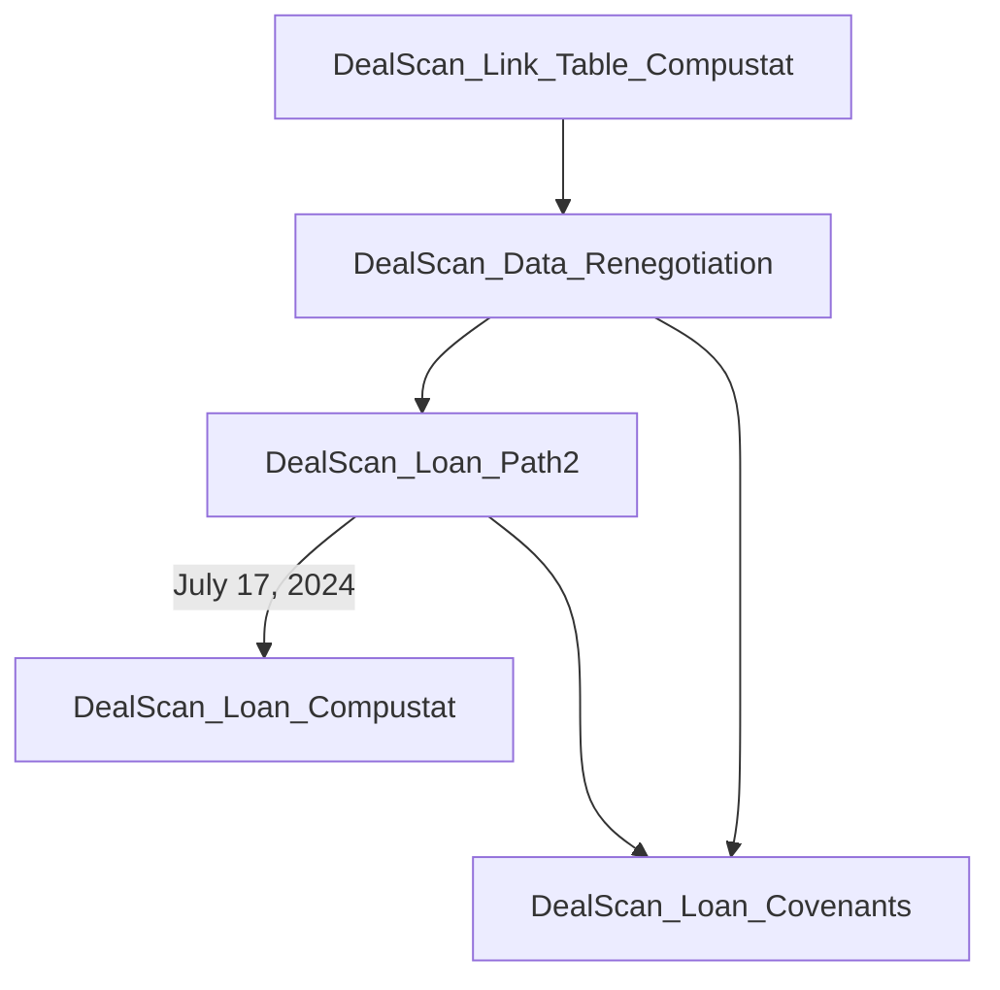

This is a document to record the roadmap: 

1.    DealScan_Link_Table_Compustat.html > DealScan_Link_Table_Compustat_Jun2024: for the link table between WRDS DealScan and WRDS Compustat.
2.    DealScan_Data_Renegotiation > DealScan_Data_Renegotiations_Jun2024: a preview on the DealScan data and delineate loan path identification and creation process.
3.    DealScan_Loan_Path2.html > DealScan_Loan_Path_Jun2024: generate the panel dataset for firm-loan-time observations and it can be linked to the Compustat dataset. 
4.    
